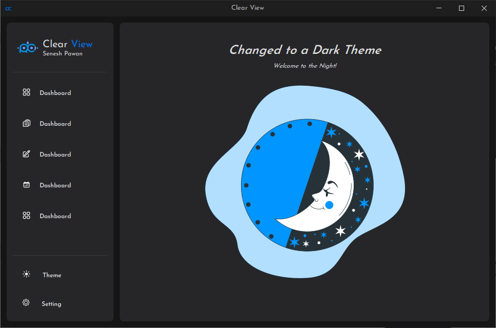

# Clear View

## Team Assignments

- **Osini**: Inventory 
- **Thamodani**: Dispensing optician 
- **Senesh**: Optometrist Doctor  
- **Sheran**: Technician
- **Isira**: Admin
- **Dhanushka**: Receptionist
- **Isiri**: Finance

## Getting Started Resources

- MySQL Database Google Drive Link - [DataBase](https://drive.google.com/drive/folders/1UcJShfu3SfnPhUE_UxamXRQiX7mU1keP?usp=sharing)
- Work Flow Helper of Clear View Project - [Work Flow](https://1drv.ms/w/c/4ba2052d68c74c09/EbsXzfGrOEFOo4TlMZy7XEABb1kLaO88Gh8Unx0I_zrSqg?e=Jp5Yuz)

## Links

- GitHub - [Project GitHub Repository](https://github.com/SeneshCode/ClearView)
- MindMap - [Project Mind Map](https://mm.tt/app/map/3457483889?t=ZOqZKnLtl9)
- Design Structure - [Project Design Structure](https://1drv.ms/p/s!AjV0cV1pTSuqvhUJWLLIeBCCeUdj?e=v42bmR)
- Presentation - [Project Presentation](https://1drv.ms/p/c/66e090791e03c55b/EYpLuax2UmhPtJynK-NfDrwBPyFsAGkT1rT4Odi6qvwKIA?e=AsEtzi)
- Activity Diagram - [Activity Diagram](https://online.visual-paradigm.com/share.jsp?id=333237333433342d35)
- Project proposal - [Project proposal ClearView](https://1drv.ms/w/s!AlZVGvNYSWtljn1A8Oclivr3FLpL?e=zLqrSM)
- Track Tasks - [Track Project Tasks](https://docs.google.com/spreadsheets/d/16YhA8w9VYWCigiyo6h95EXaUB0WBxx84EmUaNq9X16A/edit?gid=1919180471#gid=1919180471)
- Icon Site - [png icons](https://icons8.com/icons/set/icons)
- HeroIcon Site - [svg icons](https://heroicons.com/outline)
- SVG Repo - [svg icons](https://www.svgrepo.com/)
- SVG Site - [Storyset for svg photos](https://storyset.com/)

## Dashboard of clear view 
- **Dark Theme version**:

- **Light Theme version**:


## Dashboard Slide Bar Icon: 
  - formet: svg
  - quantity: 2 of different color
  - color 1:
    ```
    #0360FF
    ```
  - color 2:
    ```
    #FFFFFF
    ```
  - lastly add file name to :
      - dark svg : ```dark```
      - light svg : ```light```
    

## Color Theme : 
  - High priority: ( Green ) 
```
#16A34A
```
```
[22,163,74]
```

  - Middle priority: ( Yellow )
```
#E1AC00
```
```
[225,172,0]
```

  - Danger priority: ( Red )
```
#FF4343
```
```
[255,67,67]
```

  - Default Priority: ( Blue ) 
```
#0360FF
```
```
[3,96,255]
```

## Packages Names : 
  - Osini's package name 
```
lk.clearview.part.osini 
```
  - Thamodani's package name 
```
lk.clearview.part.thamodini
```
  - Senesh's package name   
```
lk.clearview.part.senesh
```
  - Sheran's package name   
```
lk.clearview.part.sheran
```
  - Dhanushka's package name   
```
lk.clearview.part.dhanushka
```
  - Isira's package name
```
lk.clearview.part.isira
```
  - Isiri's package name
```
lk.clearview.part.isiri
```

( bellow code not use this version)
## Method of set dashboard names
 - we must call ```setNameofDashboards()``` method at constructor.
```java
    private void setNameofDashboards(){
//      name of 1st Dashboard 
        jLabel1.setText("");

//      name of 2nd Dashboard 
        jLabel6.setText("");

//      name of 3rd Dashboard 
        jLabel10.setText("");

//      name of 4th Dashboard 
        jLabel12.setText("");

//      name of 5th Dashboard
        jLabel14.setText("");
    }
```
